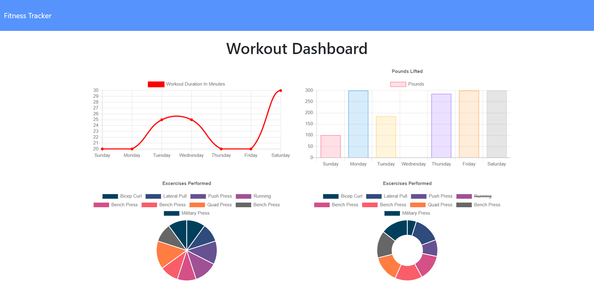

<h1 align="center">Nosql-Workout-Tracker👋</h1>
  
<p align="center">
    
    
    
    
    <a href="https://github.com/arielo5"></a>
    
</p>

<p align="center">
    
    
    
    
    
</p>

## Description

🔍 A fitness workout logger that takes in new exercises and uses MongoDB with Mongoose to log them to the database which can then be analyzed in the app's dashboard that has multiple graphic views of the different workouts.

**[Deployed Application](https://shrouded-scrubland-67243.herokuapp.com/)**
  
💻 Below is a screenshot of the application:
  


## User Story

```
As a user, 
I want to be able to view create and track daily workouts. 
I want to be able to log multiple exercises in a workout on a given day. 
I should also be able to track the name, type, weight, sets, reps, and duration of exercise. If the exercise is a cardio exercise, I should be able to track my distance traveled.
```

## Acceptance Criteria

```
When the user loads the page, they should be given the option to create a new workout or continue with their last workout.

The user should be able to:

  * Add exercises to the most recent workout plan.

  * Add new exercises to a new workout plan.

  * View the combined weight of multiple exercises from the past seven workouts on the `stats` page.

  * View the total duration of each workout from the past seven workouts on the `stats` page.
```
   
## Table of Contents
- [Description](#description)
- [User Story](#user-story)
- [Acceptance Criteria](#acceptance-criteria)
- [Table of Contents](#table-of-contents)
- [Installation](#installation)
- [Usage](#usage)
- [Credits](#credits)
- [Contributing](#contributing)
- [Questions](#questions)
- [License](#license)

## Installation
💾   
  
`npm init`

`npm install`

To install this application, first, branch the Github Repo and clone the repo to your local machine. Then, you will need to install the node dependencies which can be done by running the npm install command in your terminal/bash shell.

After the dependencies have been installed, you will need to populate your MongoDB database by un-commenting the required seed file or by running NPM Run Seed. Once filled in, you can start the server and use the program
  
## Usage
💻   
  
Once everything has been set up, the application can be launched by running the command node server.js or npm start. You will then need to visit the local host URL for the port that you have set up for this application. Once loaded in the browser, you can either click the dashboard page to view the
workout stats on the graphs provided or add/continue a workout by clicking the buttons to add or update a new workout on the home page. When adding a new workout, ensure to click complete once you have filled everything in as if you click add exercise, then it will add a blank instance of a workout
with 0 for the numbers and no string for the title/name area.

## Credits

This application was completed by Ariel Martinez as a project for University of Minnesota FULL STACK FLEX Software Development Boot Camp.

Dependencies for this project include the node modules:

-Express: for setting up the node server

-Mongoose for setting up the models for MongoDB

-Morgan for adding the http request logger

## Contributing

Have you spotted a typo, would you like to fix a link, or is there something you’d like to suggest? Browse the source repository of this article and open a pull request. I will do my best to review your proposal in due time. Click [Here](https://github.com/arielo5)

## Questions
✉️ Contact me with any questions: [email](mailto:ari.martinez.tiru@gmail.com) , [GitHub](https://github.com/arielo5)<br/>

## License

  [](https://choosealicense.com/licenses/mit/)